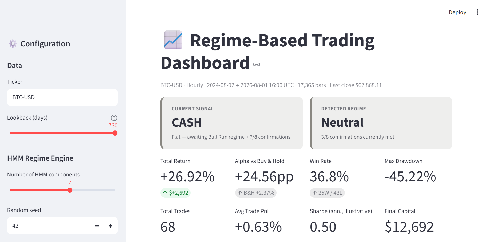
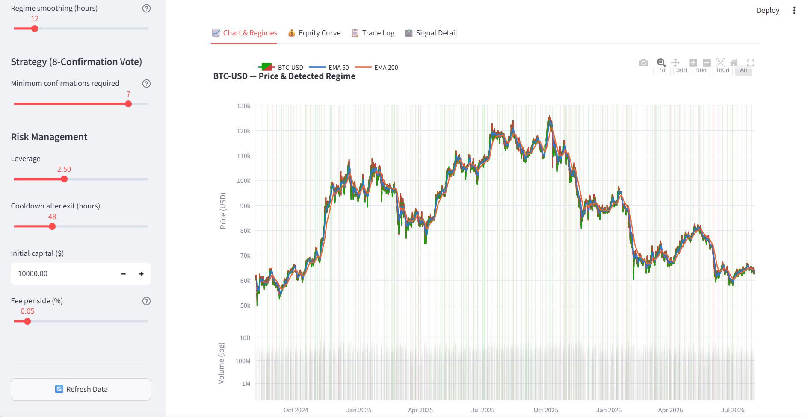
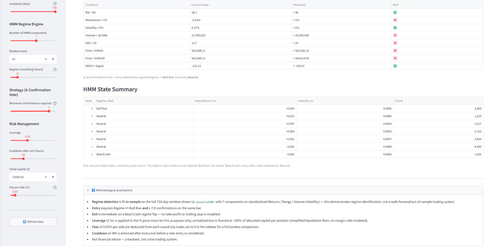
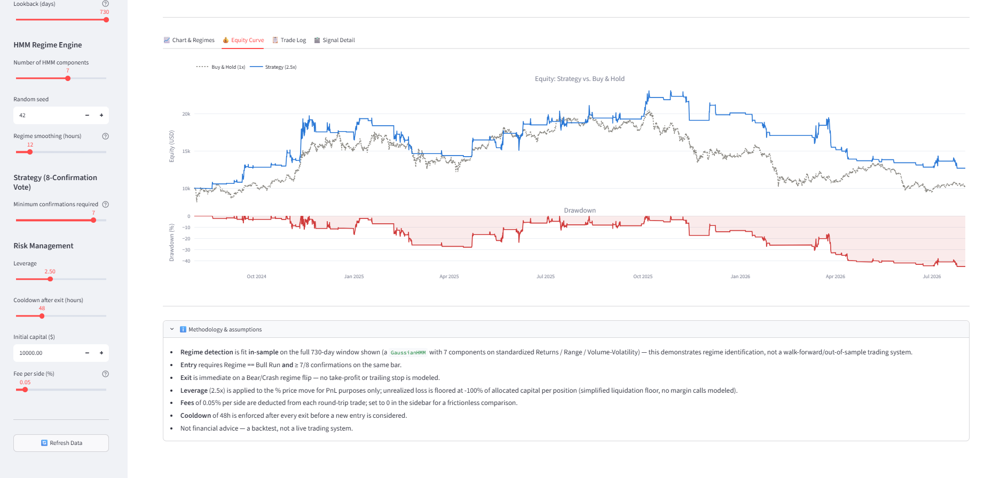
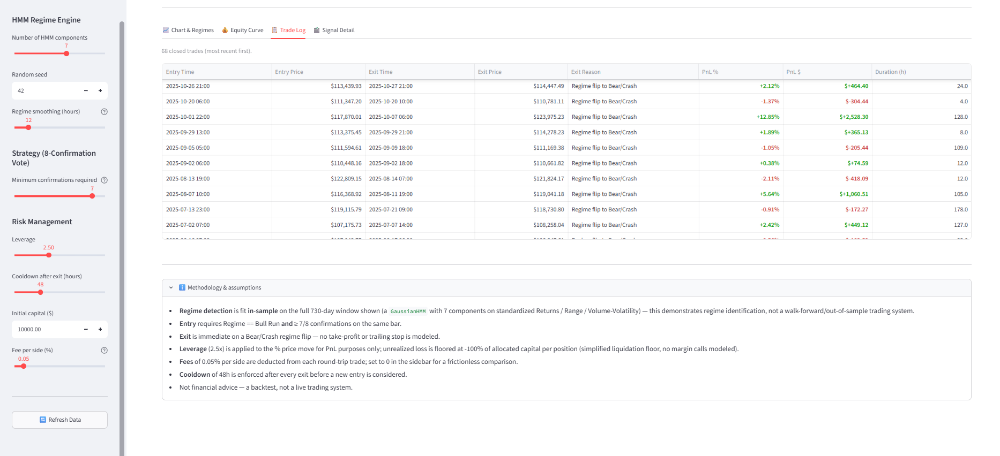

# Bitcoin HMM Market Regime Dashboard

An educational quantitative-finance application that identifies changing Bitcoin market regimes and evaluates a rule-based trading strategy through historical backtesting.




## Project Overview

Financial markets do not behave consistently. Some periods contain persistent upward trends, while others experience sharp declines, high volatility, or directionless trading. This project uses a seven-state Gaussian Hidden Markov Model to identify these changing statistical environments in hourly Bitcoin data.

The detected regime functions as the strategy's first decision filter. A simulated position can only be opened when the model identifies an acceptable bullish regime and enough technical confirmation conditions are satisfied. The application then backtests the rules and displays market regimes, simulated trades, portfolio performance, benchmark comparisons, and risk measurements in an interactive Streamlit dashboard.
## Dashboard

### Application Overview


### Market Regime Analysis



### Backtest Performance



### Portfolio Equity Curve



### Simulated Trade Log


## Key Features

- Downloads hourly BTC-USD market data
- Analyzes returns, intraperiod range, and volume behavior
- Identifies seven hidden statistical market regimes
- Applies causal regime smoothing to reduce frequent state changes
- Automatically interprets bullish, bearish, crash, and neutral conditions
- Uses an eight-condition entry-confirmation framework
- Simulates cooldowns, leverage, transaction fees, entries, and exits
- Compares strategy performance with buying and holding Bitcoin
- Displays an interactive price chart, equity curve, trade log, and performance metrics

## Project Structure

- `app.py` — Streamlit dashboard
- `data_loader.py` — Market-data collection and feature preparation
- `hmm_engine.py` — Hidden Markov Model and regime identification
- `indicators.py` — Technical indicator calculations
- `strategy.py` — Entry and exit decision rules
- `backtester.py` — Historical simulation and performance metrics
- `charts.py` — Interactive Plotly visualizations
- `config.py` — Shared application settings
- `requirements.txt` — Required Python packages

## Installation

Clone the repository:

```bash
git clone https://github.com/davidkioumejian/bitcoin-hmm-regime-dashboard.git
cd bitcoin-hmm-regime-dashboard
```

Install the required packages:

```bash
py -m pip install -r requirements.txt
```

Launch the dashboard:

```bash
py -m streamlit run app.py
```

Then open:

```text
http://localhost:8501
```

## Technologies

- Python
- Streamlit
- Plotly
- pandas
- NumPy
- scikit-learn
- hmmlearn
- yfinance

## Important Limitations

- This is an educational research project, not financial advice.
- The application performs simulated historical analysis and does not execute live trades.
- The current HMM is fitted in-sample on the selected historical window.
- Historical backtest performance does not guarantee future results.
- Transaction costs and leveraged losses are modeled using simplified assumptions.
- The application should not be used to make real-money trading decisions without additional out-of-sample validation and risk testing.
## Project Origin and Attribution

This is a tutorial-guided, AI-assisted educational project based on
["How To Actually Use Claude Code for Trading Strategies"](https://www.youtube.com/watch?v=EUSXhJNwRqI)
by [AI Pathways].

I followed the demonstrated workflow and used Claude Code to generate and
refine the implementation. My work included configuring and running the
application, testing the pipeline, investigating errors, organizing the
repository, documenting the methodology, and publishing the project.

This project is not presented as an independently conceived trading strategy
or as financial advice. It is intended for education and experimentation.